# Antar.AI (Journal Companion) – Design Document

Design document for the AI-powered journaling companion. It outlines **design choices**, the **technical stack** (programming languages, frameworks, libraries, AI models), **architecture** (components and data flow), and **potential future enhancements**.

---

## 1. Purpose and scope

**Antar.AI** helps users maintain a consistent journaling practice with:

- **Context-aware prompts** – Daily nudges and follow-up prompts based on recent themes.
- **Private sentiment and theme analysis** – All processing in your infrastructure; journal content is not sent to third parties for training.
- **Reflection summaries** – Daily, weekly, and monthly summaries that connect patterns without judgment or prescriptive advice.

**Scope of this document:** Current system architecture, all services and components, and data flow.

The app is built to be **supportable and extensible**: you can run it **NLP-only** (keyword- and rule-based sentiment, themes, and prompts) without any LLM, or extend it with a local or cloud LLM. We use **TinyLlama** (via Ollama) when an LLM is enabled—lightweight and suitable for local deployment.

---

## 2. Design choices

Key decisions that shape the architecture:

| Choice | Rationale |
|--------|-----------|
| **Microservices per concern** | Auth, Journal, Prompt, Insights, and Summary are separate services so each can be developed, tested, and scaled independently. Clear boundaries reduce coupling and allow different stacks per domain (e.g. Java for Journal, Python for AI). |
| **Event-driven analytics** | Journal Service publishes `entry.created` to Kafka; an AI consumer processes entries asynchronously. The API stays fast and analytics (sentiment, themes) are eventually consistent without blocking the user. |
| **JWT-only identity** | Auth issues JWTs; other services verify the same `JWT_SECRET` and use `sub` as `userId`. No per-request calls to Auth, which keeps latency low and simplifies deployment. |
| **Separate Journal DB and Analytics DB** | Journal DB holds source-of-truth entries; Analytics DB holds derived sentiment, themes, and summaries. Separation keeps write load off the journal store and allows different retention or scaling for analytics. |
| **SPA + backend APIs** | A single React app talks to multiple backends with JWT. Users get a unified experience (Today, History, Dashboard, Summary, Profile) while services stay stateless and API-first. |
| **Extensible: NLP-only or LLM** | The system is designed to be **supportable and extensible**. You can run **NLP-only** (keyword/rule-based sentiment, themes, and prompts) with no LLM, or extend with an LLM (we use **TinyLlama** via Ollama). Fallbacks keep the app usable without an API key or local model. |
| **Privacy-first AI** | All journal processing runs in your infrastructure. Content is not sent to third parties for training; optional cloud LLM usage is for inference only, with configurable provider and model. |

---

## 3. Technical stack

### 3.1 Programming languages

| Layer | Language | Version |
|-------|----------|---------|
| Frontend | JavaScript (React) | ES modules, React 18 |
| Auth Service | Node.js (JavaScript) | LTS |
| Journal Service | Java | 17 |
| Prompt Service | Python | 3.10+ |
| AI Consumer, Insights API, Summary Service | Python | 3.10+ |
| Data | SQL (PostgreSQL) | — |

### 3.2 Frameworks and runtimes

| Component | Framework / runtime |
|-----------|----------------------|
| Frontend | React 18, Vite 5, React Router 6 |
| Auth | Express 4 (Node.js) |
| Journal | Spring Boot 3 (Java 17) |
| Prompt, Insights, Summary, AI Consumer | FastAPI, Uvicorn (Python) |

### 3.3 Key libraries

| Area | Libraries |
|------|-----------|
| **Frontend** | Tailwind CSS, PostCSS, Autoprefixer, Recharts (charts) |
| **Auth** | jsonwebtoken (JWT), cors, uuid |
| **Journal** | Spring Web, Spring Data JPA, Spring Kafka, Spring Security, JJWT, PostgreSQL driver, SpringDoc OpenAPI, Actuator |
| **Prompt** | FastAPI, httpx, python-dotenv, OpenAI Python client |
| **AI services** | kafka-python, psycopg2-binary, SQLAlchemy, python-dotenv, OpenAI Python client, PyJWT |

### 3.4 AI models and providers

The system is **extensible**: it runs **NLP-only** (no LLM) by default using keyword/rule-based sentiment, themes, and prompt fallbacks. When an LLM is enabled, we use **TinyLlama** (via Ollama) for local, lightweight inference; OpenAI or other OpenAI-compatible providers are also supported.

| Use case | Mode | Provider / model | Config (env) |
|----------|------|------------------|--------------|
| **Today / follow-up prompts** | NLP-only or LLM | **Ollama: TinyLlama** (default); or OpenAI: `gpt-3.5-turbo` | `LLM_PROVIDER`, `OPENAI_API_KEY`, `OPENAI_MODEL`, `OLLAMA_BASE_URL`, `OLLAMA_MODEL` |
| **Sentiment and themes** | NLP-only by default; optional LLM | Keyword/rule-based; optional TinyLlama or OpenAI for richer labels | Same as above (shared across Prompt and ai-services) |
| **Reflection summaries (daily/weekly/monthly)** | NLP-only or LLM | TinyLlama (Ollama) or OpenAI; fallback when unavailable | Same |

The LLM path uses the **OpenAI Python client** with an OpenAI-compatible API: a local Ollama server (TinyLlama) or OpenAI’s API. One configuration works across Prompt and ai-services. With no LLM configured, the app operates in **NLP-only** mode throughout.

### 3.5 Data and messaging infrastructure

| Component | Technology |
|-----------|------------|
| Journal DB | PostgreSQL (port 5432) |
| Analytics DB | PostgreSQL (port 5433) |
| Message bus | Apache Kafka (e.g. port 9092) |

---

## 4. Architecture – block diagram

Current architecture: client, frontend, backend services, data & messaging, and AI workers.

```mermaid
%%{init: {'theme':'base', 'themeVariables': { 'fontSize':'14px', 'fontFamily':'system-ui' }}}%%
flowchart TB
    subgraph Client["🖥️ Client"]
        direction TB
        Browser(["User / Browser"])
    end

    subgraph Frontend["⚛️ Frontend"]
        direction TB
        SPA["SPA · React · Vite<br/>Today · History · Dashboard · Summary · Profile"]
    end

    subgraph Backend["🔧 Backend Services"]
        direction TB
        Auth["Auth Service<br/>Node · Express · JWT"]
        Journal["Journal Service<br/>Java · Spring Boot"]
        Prompt["Prompt Service<br/>Python · FastAPI"]
        Insights["Insights API<br/>Python · FastAPI"]
        Summary["Summary Service<br/>Python · FastAPI"]
    end

    subgraph Data["💾 Data & Messaging"]
        direction TB
        JournalDB[(Journal DB<br/>PostgreSQL)]
        AnalyticsDB[(Analytics DB<br/>PostgreSQL)]
        Kafka[(Kafka)]
    end

    subgraph Workers["🤖 AI Workers"]
        direction TB
        Consumer["AI Consumer<br/>Python · Kafka"]
    end

    Browser <--> SPA
    SPA -->|JWT| Auth
    SPA -->|JWT| Journal
    SPA -->|JWT| Prompt
    SPA -->|JWT| Insights
    SPA -->|JWT| Summary

    Auth -->|sign JWT| SPA
    Journal --> JournalDB
    Journal -->|publish| Kafka
    Prompt -->|fetch entries| Journal
    Insights --> AnalyticsDB
    Summary --> AnalyticsDB
    Consumer -->|subscribe| Kafka
    Consumer -->|write| AnalyticsDB

    style Client fill:#e3f2fd,stroke:#1565c0,stroke-width:2px
    style Frontend fill:#e8f5e9,stroke:#2e7d32,stroke-width:2px
    style Backend fill:#fff3e0,stroke:#ef6c00,stroke-width:2px
    style Data fill:#f3e5f5,stroke:#7b1fa2,stroke-width:2px
    style Workers fill:#fff8e1,stroke:#f9a825,stroke-width:2px
    style Browser fill:#bbdefb
    style SPA fill:#c8e6c9
    style Auth fill:#ffe0b2
    style Journal fill:#ffe0b2
    style Prompt fill:#ffe0b2
    style Insights fill:#ffe0b2
    style Summary fill:#ffe0b2
    style JournalDB fill:#e1bee7
    style AnalyticsDB fill:#e1bee7
    style Kafka fill:#e1bee7
    style Consumer fill:#ffecb3
```

---

## 5. Components and services

### 5.1 Frontend

| Attribute | Description |
|-----------|-------------|
| **Stack** | React 18, Vite, React Router, Tailwind CSS |
| **Port** | 3000 (dev), configurable |
| **Responsibility** | Single-page app: **Today** (prompts, write entry, mood, streak, quick check-in), **History**, **Dashboard** (sentiment, themes, insights, suggested actions), **Summary** (daily/weekly/monthly reflections), **Profile**. Sends JWT with all API calls. Brand: Antar.AI. |

**Key flows:** Login/signup (Auth), create/read entries (Journal), get prompts (Prompt), read insights (Insights API), read summaries (Summary Service).

---

### 5.2 Auth Service

| Attribute | Description |
|-----------|-------------|
| **Stack** | Node.js, Express |
| **Port** | 3001 |
| **Responsibility** | Sign up, login. Issues JWT with `sub` = userId. Stores users (e.g. `users.json`) with email, firstName, lastName. Optional PATCH profile. Does not call other services. |

**Identity:** Only Auth issues tokens; Journal, Prompt, Insights, and Summary verify the same `JWT_SECRET` and use `sub` as `userId`.

---

### 5.3 Journal Service

| Attribute | Description |
|-----------|-------------|
| **Stack** | Java 17, Spring Boot 3 |
| **Port** | 8080 |
| **Responsibility** | CRUD journal entries. Persists to **Journal DB** (PostgreSQL). On create, publishes `entry.created` to **Kafka**. Verifies JWT for all entry APIs. Exposes streak and recent entries for Prompt Service. |

**APIs (typical):** POST/GET /entries, GET /entries/streak, optional GET for recent entries (used by Prompt Service).

---

### 5.4 Prompt Service

| Attribute | Description |
|-----------|-------------|
| **Stack** | Python 3.10+, FastAPI |
| **Port** | 8000 |
| **Responsibility** | GET “today” prompt (pre-entry nudge from recent themes). GET follow-up prompts after save. Fetches recent entries from Journal (with JWT); uses LLM (TinyLlama via Ollama, or OpenAI) or NLP-only keyword fallback. |

---

### 5.5 AI Consumer (Kafka consumer)

| Attribute | Description |
|-----------|-------------|
| **Stack** | Python, Kafka consumer |
| **Responsibility** | Subscribes to `journal.entry.created`. For each entry: computes sentiment, emotions, themes. Writes results to **Analytics DB**. Part of **ai-services** (with Insights API and Summary Service). |

**Event-driven:** Journal Service does not wait for analytics; consumer runs asynchronously.

---

### 5.6 Insights API

| Attribute | Description |
|-----------|-------------|
| **Stack** | Python, FastAPI (in ai-services) |
| **Port** | 8001 |
| **Responsibility** | Sentiment over time, themes with counts, theme–sentiment breakdown, emotions over time, patterns, actionable suggestions. All JWT-scoped; reads **Analytics DB** only. |

---

### 5.7 Summary Service

| Attribute | Description |
|-----------|-------------|
| **Stack** | Python, FastAPI (in ai-services) |
| **Port** | 8002 |
| **Responsibility** | GET latest / generate daily, weekly, monthly reflection summaries. Stores structured JSON in **Analytics DB**. Weekly: emotional snapshot, recurring themes, reflection questions. Monthly: overall tone, theme evolution, progress, looking ahead. |

---

## 6. Data stores and messaging

### 6.1 Journal DB (PostgreSQL, port 5432)

- **journal_entry** – id, user_id, content, mood, created_at, updated_at.
- Owned by Journal Service. Prompt Service reads recent entries (with JWT) for context-aware prompts.

### 6.2 Analytics DB (PostgreSQL, port 5433)

- **sentiment_result** – entry_id, user_id, score (-1..1), label, emotions (JSONB), entry_created_at, computed_at.
- **theme_result** – entry_id, user_id, themes (JSONB), entry_created_at, computed_at.
- **reflection_summary** – user_id, period_start, period_end, period_type (daily/weekly/monthly), summary_text, generated_at.

Written by AI Consumer; read by Insights API and Summary Service.

### 6.3 Kafka

- **Topic:** `journal.entry.created` (configurable).
- **Payload:** entryId, userId, content, createdAt (and optional fields).
- **Producer:** Journal Service on entry create.
- **Consumer:** AI Consumer (single group); processes each message once, writes to Analytics DB.

---

## 7. Security and identity

- **JWT** – Only Auth Service issues tokens. Journal, Prompt, Insights, and Summary verify the same `JWT_SECRET` and use `sub` as `userId`. No service calls Auth at request time.
- **CORS** – Frontend origins (e.g. localhost:3000, localhost:5173) are allowlisted.
- **Data isolation** – All queries filter by `user_id` from JWT; no cross-user access.

---

## 8. Ports and URLs

| Service | Port | Default URL / env |
|---------|------|--------------------|
| Frontend | 3000 | http://localhost:3000 |
| Auth | 3001 | VITE_AUTH_URL |
| Journal | 8080 | VITE_JOURNAL_URL |
| Prompt | 8000 | VITE_PROMPT_URL |
| Insights | 8001 | VITE_INSIGHTS_URL |
| Summary | 8002 | VITE_SUMMARY_URL |
| Journal DB | 5432 | — |
| Analytics DB | 5433 | ANALYTICS_DB_URL |
| Kafka | 9092 | KAFKA_BOOTSTRAP_SERVERS |

---

## 9. Potential future enhancements

Planned improvements are described in detail below.

Summary:

| Area | Enhancements |
|------|--------------|
| **Monitoring** | Prometheus metrics, Grafana dashboards, HTTP health/ready endpoints, centralized logging (e.g. Loki, ELK), and alerting on errors, consumer lag, and SLA breaches. |
| **Notification** | Dedicated notification service for reminders (“Time for a check-in?”), streak milestones, and event-based email or push; user preferences for channel, frequency, and quiet hours. |
| **Load balancing** | Reverse proxy (Nginx, Traefik, or cloud ALB) in front of all services; multiple stateless replicas for Auth, Journal, Prompt, Insights, Summary; Kafka consumer groups for throughput; DB connection pooling and read replicas as load grows. |

Further opportunities for a more empathetic, NLP-rich experience (emotion taxonomy, theme–sentiment links, per-entry reflections, smarter summary prompts).

---

## 10. Summary

**Current system:** React frontend (Antar.AI) talks to Auth (JWT), Journal (entries + Kafka), Prompt (context-aware prompts), Insights (sentiment/themes from Analytics DB), and Summary (reflection summaries). An AI consumer subscribes to Kafka, computes sentiment and themes per entry, and writes to Analytics DB.

**Planned improvements:** Add **monitoring** (Prometheus, Grafana, health checks, centralized logs and alerting), **notification** (dedicated service for reminders and streak/event-based email or push), and **load balancing** (reverse proxy and multiple instances of stateless services for availability and scale).
